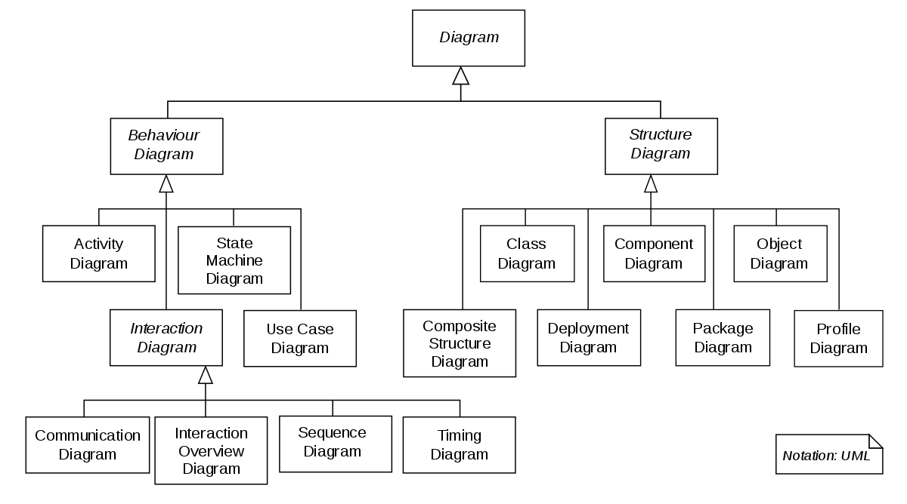

# CODE QUALITY & DOCUMENTATION
This document covers main rules and best practices for code quality and documentation.

## Contents
1. [Using README.md files](#readme)
1. [UML files](#uml)
1. [Quick start to md files](#quick_start)

## Using README.md files <a name="readme"></a>
The following rules should <b>always</b> be followed:
0. Contents
1. A README.md file is always included in the Git repository.
2. The README.md file is updated every time a commit is pushed.

### What should the README include?
The README should contian everything that a new programmer needs in order to run and work on the code. This includes:
- An explonation of what the software does. 
- [UML diagrams](#uml) that show the design of the system. Focus on the 25% most important details.
- Explaning dependencies, how to install and how to run the code.


## UML diagrams <a name="uml"></a>
UML diagrams are great for letting other programmers understand your code -quickly. Please follow these UML guidelines.
### What to cover in UML diagrams
The UML diagrams should make the system easy to understand. Please cover the following abstraction levels:
1. System subsystems and their interactions.
2. The internal classes of each subsystem.
3. The data and routines of the classes.
You don't need to cover everything! Stick to what matters.

You are also encouraged to include:

- Activity diagrams
- State machine diagrams
- Sequence diagrams

or any other diagram that might help explain the software.

### How to make and include UML diagrams
The UML diagrams should either be:

1. Mermaid graphs (for power users)
	* These graphs can be created in the README file.
2. XML files
	* These are easy to make using websites such as [iodraw.com](https://www.iodraw.com).
	* Copy paste the XML code into the README.md. See instructions bellow.
3. PNG files (for normal users)
	*These are easy to make using websites such as [iodraw.com](https://www.iodraw.com).
	*Store the XML source files in the git directory. The graph will probably be edited later!

I recommend either using PNG files or Mermaid.

#### Mermaid 
This is a simple Mermaid graph.

It was created by writing the following into the README file:

```
```mermaid
graph TD;
    A-->B;
    A-->C;
    B-->D;
    C-->D;
``` ```
 #### PNG files
<b>Important</b>: Store the xml file that you used to genreate the png file!
Bellow you see a PNG file:



The PNG file is included into this file using:

```


```

Note that the file is stored in the ` uml-example ` folder.
The PNG files should must be stored in the same project as the README.md file. The PNG files should be stored in the same directory as the file it describes.

#### XML files


```
```xml
Insert xml code here
``` ```

## Quick start: <a name="quick_start"></a>
We will have a quick look at how md files work. First, let's see how this file was formatted!
1. Read the example chapter bellow.
1. Open the README.md file (click the link in gitlab) 
1. Click edit and find the example chapter.
1. Look at how easy the formatting is! Just a few symbols here and there. This will take 5 min to learn! 
<br>
Now that you know how easy this is, open this [link](https://support.squarespace.com/hc/en-us/articles/206543587-Markdown-cheat-sheet). Read through a couple of examples. You will then be ready to edit these files in 1-2-3! Googling will show you the way from here. 

#### Examle Chapter:
##### Adding in code snippets
```
#This is code
echo 'hello world!'
mkdir .some_hidden_folder
ls
```
The output of this **command** is empty. However, try
```
ls -a
```
This returns
```
.some_hidden_folder
```
##### Adding diagrams
Have a look at this awsome *diagram*:


#### Some formatting
> Some text
>> Some point
>>> Some subpiont

Hide long explonations in boxes like these:
<details>
<summary><b>Hide information</b></summary>

1. Show longer explonations in here!

2. This makes the readme easier to read.

</details>
Use <b>nested</b> details if you have points, within points.

<details> 
<summary><b>Nested details</b></summary>
<blockquote>
	<details>
		<summary><b>Details</b></summary>
		Some content.
	</details>
	<details>
		<summary><b>Details</b></summary>
		Some content.
	</details>
</blockquote>
</details>

