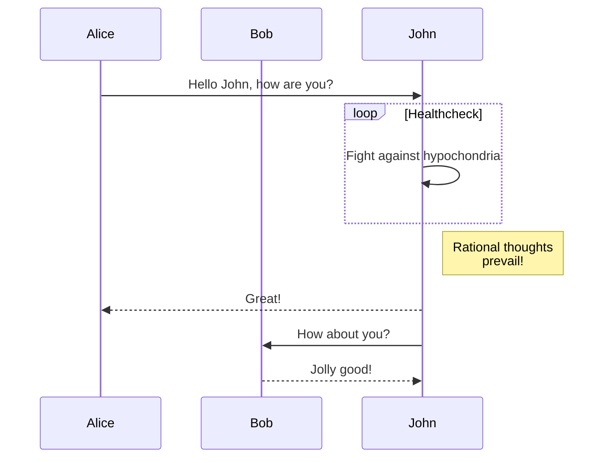

# Tools for future planning
An example of a graph

graph TD
  subgraph Ground  Station
  gnd[ROS Enabled Computer] --- qgc[qGroundControl]
  end
  gnd --MAVLink/UDP-- > w[WiFi];
  qgc --MAVLink-- > w;
  subgraph Vehicle
  comp[Companion Computer] --MAVLink-- > uart[UART Adapter]
  uart --- Autopilot
  end
  w --- comp
-->
